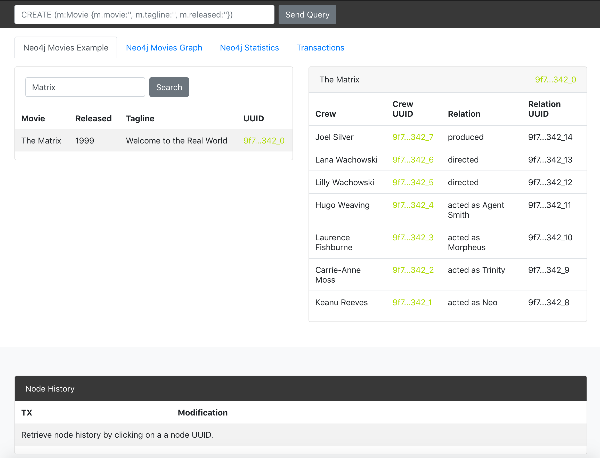

# Neo4j & Exonum Demo Application



## Stack

* [Neo4j Bolt JavaScript Driver](https://github.com/neo4j/neo4j-javascript-driver)
* Neo4j
* Exonum
* Frontend: ES6, jquery, bootstrap, [d3.js](http://d3js.org/)
* Webpack for building web assets

## Quickstart

### Setup
Install NodeJS and run the following command:

```bash
$ npm install 
```

### Run locally

* Start the Exonum service and Neo4j database
* Create you own .ENV file
* Run the App with the following command.

```bash
$ npm run start
```

Insert your first query:
```cypher
CREATE (TheMatrix:Movie {title:'The Matrix', released:1999, tagline:'Welcome to the Real World'})
CREATE (Keanu:Person {name:'Keanu Reeves', born:1964})
CREATE (Carrie:Person {name:'Carrie-Anne Moss', born:1967})
CREATE (Laurence:Person {name:'Laurence Fishburne', born:1961})
CREATE (Hugo:Person {name:'Hugo Weaving', born:1960})
CREATE (LillyW:Person {name:'Lilly Wachowski', born:1967})
CREATE (LanaW:Person {name:'Lana Wachowski', born:1965})
CREATE (JoelS:Person {name:'Joel Silver', born:1952})
CREATE
  (Keanu)-[:ACTED_IN {roles:'Neo'}]->(TheMatrix),
  (Carrie)-[:ACTED_IN {roles:'Trinity'}]->(TheMatrix),
  (Laurence)-[:ACTED_IN {roles:'Morpheus'}]->(TheMatrix),
  (Hugo)-[:ACTED_IN {roles:'Agent Smith'}]->(TheMatrix),
  (LillyW)-[:DIRECTED]->(TheMatrix),
  (LanaW)-[:DIRECTED]->(TheMatrix),
  (JoelS)-[:PRODUCED]->(TheMatrix)
```
```cypher
MATCH (Keanu:Person {name:'Keanu Reeves'}),
    (Carrie:Person {name:'Carrie-Anne Moss'}),
    (Laurence:Person {name:'Laurence Fishburne'}),
    (Hugo:Person {name:'Hugo Weaving'}),
    (LillyW:Person {name:'Lilly Wachowski'}),
    (LanaW:Person {name:'Lana Wachowski'}),
    (JoelS:Person {name:'Joel Silver'})
CREATE (TheMatrix:Movie {title:'The Matrix2', released:2000, tagline:'Boring sequel'})
CREATE
  (Keanu)-[:ACTED_IN {roles:'Neo'}]->(TheMatrix),
  (Carrie)-[:ACTED_IN {roles:'Trinity'}]->(TheMatrix),
  (Laurence)-[:ACTED_IN {roles:'Morpheus'}]->(TheMatrix),
  (Hugo)-[:ACTED_IN {roles:'Agent Smith'}]->(TheMatrix),
  (LillyW)-[:DIRECTED]->(TheMatrix),
  (LanaW)-[:DIRECTED]->(TheMatrix),
  (JoelS)-[:PRODUCED]->(TheMatrix)
```
```cypher
MATCH (Keanu:Person {name:'Keanu Reeves'})
CREATE (TheMatrix:Movie {title:'The Matrix2', released:2000, tagline:'Boring sequel'})
CREATE
  (Keanu)-[:ACTED_IN {roles:['Neo']}]->(TheMatrix)
```
This will create a new movie 'The Matrix'. Now you can make changes to the created nodes with new queries and these changes will be
  reflected in the node history.